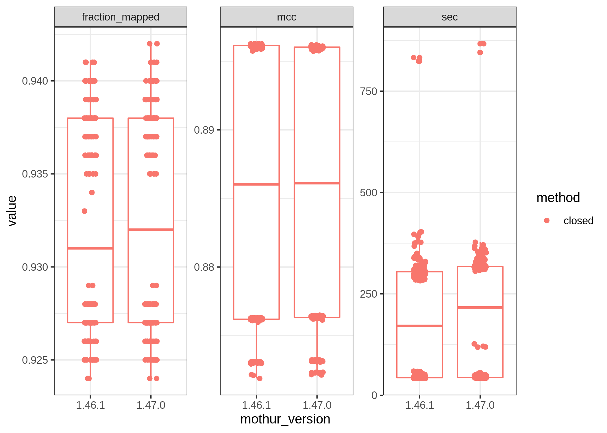

<!-- README.md is generated from README.Rmd. Please edit that file -->

# test-opti-random

<!-- badges: start -->
<!-- badges: end -->

Testing the changes Sarah Westcott made to OptiFit in the mothur 1.47.0
branch.

## Setup

On GreatLakes, clone the repos and compile mothur version 1.47.0

``` bash
git clone https://github.com/kelly-sovacool/test-opti-random
git clone https://github.com/mothur/mothur
cd mothur
git checkout 1.47.0
module load gcc/4.8.5   
module load boost/1.70.0
make -j 4 -f Makefile_cluster USEBOOST=yes BOOST_LIBRARY_DIR=${BOOST_LIB} BOOST_INCLUDE_DIR=${BOOST_INCLUDE} USEHDF5=no install
cd ..
cp mothur/mothur test-opti-random/bin/mothur-1.47.0/
```

Install other dependencies and activate the conda environment:

``` bash
cd test-opti-random
conda env create -f config/env.simple.yml
conda activate optifit
```

Run the workflow locally:

``` bash
snakemake -j 4
```

or on the cluster: (modify your email and account name first)

    sbatch code/submit_KLS.sh

## Results

``` r
library(tidyverse)
config <- yaml::read_yaml('config/config.yaml')

# like the Python range function
py_range <- function(start, stop, step) {
  seq.int(start, stop - 1, step)
}
```

``` r
mothur_1.46.1 <- read_tsv('results/optifit_1.46.1.tsv') %>% 
  mutate(mothur_version = '1.46.1') %>% 
  filter(dataset %in% config[['datasets']],
         ref_weight %in% config[['weights']],
         method %in% config[['methods']],
         seed <= config[['seeds']],
         ref_frac %in% c(py_range(config[['ref_fracs']][['start']],
                                  config[['ref_fracs']][['stop']],
                                  config[['ref_fracs']][['step']])/10)
         )
#> Rows: 8800 Columns: 42
#> ── Column specification ────────────────────────────────────────────────────────
#> Delimiter: "\t"
#> chr   (4): dataset, method, ref_weight, tool
#> dbl  (32): label, cutoff, numotus, tp, tn, fp, fn, sensitivity, specificity,...
#> lgl   (5): printref, check_split_passed, ref, region, criteria
#> time  (1): h:m:s
#> 
#> ℹ Use `spec()` to retrieve the full column specification for this data.
#> ℹ Specify the column types or set `show_col_types = FALSE` to quiet this message.
mothur_1.47.0 <- read_tsv('results/optifit_split_results.tsv') %>% 
  mutate(mothur_version = '1.47.0')
#> Rows: 20 Columns: 42
#> ── Column specification ────────────────────────────────────────────────────────
#> Delimiter: "\t"
#> chr   (4): dataset, method, ref_weight, tool
#> dbl  (32): label, cutoff, numotus, tp, tn, fp, fn, sensitivity, specificity,...
#> lgl   (5): printref, check_split_passed, ref, region, criteria
#> time  (1): h:m:s
#> 
#> ℹ Use `spec()` to retrieve the full column specification for this data.
#> ℹ Specify the column types or set `show_col_types = FALSE` to quiet this message.
dat <- bind_rows(mothur_1.46.1, mothur_1.47.0) %>% 
  rename(sec = s) %>% 
  select(dataset, mothur_version, method, ref_weight, ref_frac, seed, mcc, sec, fraction_mapped)
```

### Plots

``` r
dat %>% 
  pivot_longer(c(mcc, sec, fraction_mapped), names_to = 'metric') %>% 
  #filter(metric != 'fraction_mapped' | (method == 'closed' & metric == 'fraction_mapped')) %>% 
  ggplot(aes(x = mothur_version, y = value, color = method)) +
  geom_boxplot(show.legend = FALSE) +
  geom_jitter(width = 0.1) +
  facet_wrap('metric', scales = 'free') +
  theme_bw()
```

<!-- -->
